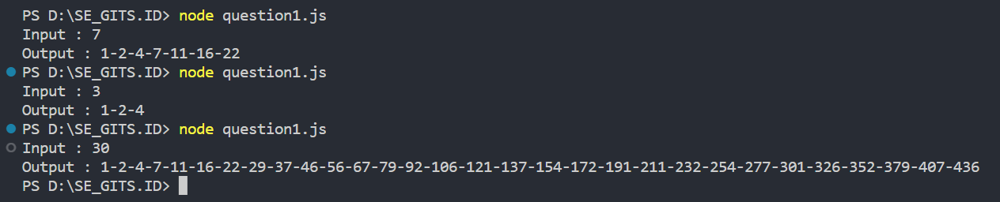
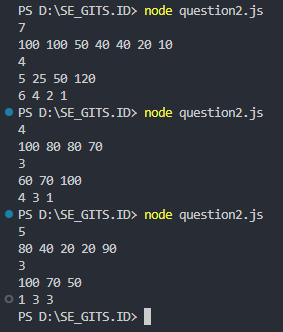
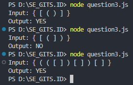

# Internship - Problem Solving Test

## About

Repository ini berisi jawaban dari 3 soal Problem Solving beserta screenshot output. Saya mengambil role BE dengan JavaScript.

1. [A000124 of Sloane’s OEIS](https://github.com/arizkinewbie/SE_GITS.ID/blob/master/question1.js)
   

2. [Dense Ranking](https://github.com/arizkinewbie/SE_GITS.ID/blob/master/question2.js)

3. [Balanced Bracket](https://github.com/arizkinewbie/SE_GITS.ID/blob/master/question3.js)

   **Penjelasan Detail Kompleksitas Balanced Bracket**

   1. Waktu Kompleksitas `(O(n))`:
      Fungsi akan memproses setiap karakter dalam input string dengan kompleksitas waktu `O(n)`, di mana n adalah panjang input string. Tidak ada nested loops atau operasi yang memperumit proses, sehingga kompleksitas ini merupakan kompleksitas dominan.

   2. Ruang Kompleksitas `(O(k))`:
      Fungsi menggunakan tumpukan (stack) untuk menyimpan karakter bracket terbuka. Jumlah karakter bracket terbuka maksimum yang dapat ada dalam input string adalah k, misalnya jika semua karakter adalah bracket terbuka. Sehingga ruang kompleksitasnya adalah `O(k)`.

   3. Kesimpulan:
      Keseluruhan kompleksitas fungsi ini adalah `O(n + k)`, di mana n adalah panjang input string dan `k` adalah jumlah karakter bracket terbuka maksimum yang dapat ada dalam input string. Namun, karena `k` lebih kecil daripada `n (k < n)`, maka kompleksitas keseluruhan dapat disederhanakan menjadi `O(n)`.
